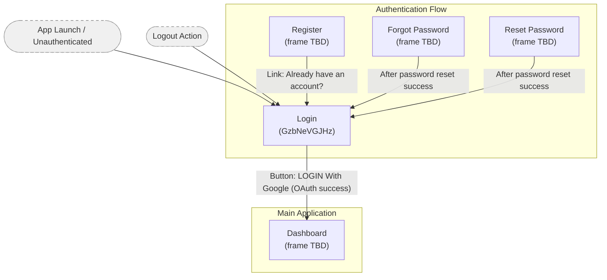
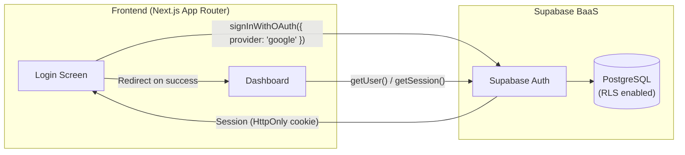

# Screen Flow Overview

## Project Info
- **Project Name**: SSA 2025
- **Figma File Key**: 9ypp4enmFmdK3YAFJLIu6C
- **MoMorph URL**: https://momorph.ai/files/9ypp4enmFmdK3YAFJLIu6C/screens/GzbNeVGJHz
- **Created**: 2026-04-22
- **Last Updated**: 2026-04-22

---

## Discovery Progress

| Metric | Count |
|--------|-------|
| Total Screens | 1 (known so far) |
| Discovered | 1 |
| Remaining | unknown |
| Completion | partial |

---

## Screens

| # | Screen Name | Frame ID | Figma Link | Status | Detail File | Predicted APIs | Navigations To |
|---|-------------|----------|------------|--------|-------------|----------------|----------------|
| 1 | Login | GzbNeVGJHz (Figma: 662:14387) | https://momorph.ai/files/9ypp4enmFmdK3YAFJLIu6C/screens/GzbNeVGJHz | specs-ready | `.momorph/specs/GzbNeVGJHz-login/spec.md` | `supabase.auth.signInWithOAuth` | Dashboard |

---

## Navigation Graph

---

## Navigation Edges — Login Screen Detail

### Incoming to Login (what navigates TO Login)

| Source | Trigger | Condition | Confidence |
|--------|---------|-----------|------------|
| App Launch | Automatic redirect | User is unauthenticated / no valid session | High |
| Logout | Automatic redirect | User triggers logout action from any authenticated screen | High |
| Register screen | Link "Already have an account? Sign in" | User already has an account | Medium |
| Forgot Password screen | Automatic redirect or link | Password reset flow completed | Medium |
| Reset Password screen | Automatic redirect | Token used / reset success | Medium |

### Outgoing from Login (what Login navigates TO)

| Target Screen | Trigger Element | Condition | Confidence | Notes |
|---------------|-----------------|-----------|------------|-------|
| Dashboard | Button: "LOGIN With Google" | Supabase Auth Google OAuth returns valid session | High | Only exit path; confirmed in Figma design |
| Forgot Password | — | — | None | NO link present in this design |
| Register | — | — | None | NO link present in this design |

---

## Screen Groups

### Group: Authentication
| Screen | Purpose | Entry Points |
|--------|---------|--------------|
| Login | Authenticate users exclusively via Google OAuth (Supabase Auth) — no email/password form | App launch (unauthenticated), Logout |
| Register | New user sign-up | Login screen link |
| Forgot Password | Initiate password reset flow | Login screen link |
| Reset Password | Set new password via token link | Email deep link |

### Group: Main Application
| Screen | Purpose | Entry Points |
|--------|---------|--------------|
| Dashboard | Primary hub after authentication | Successful Login |

---

## API Endpoints Summary

| Endpoint | Method | Screens Using | Purpose |
|----------|--------|---------------|---------|
| /auth/login (Supabase) | POST | Login | Authenticate user, issue session (HttpOnly cookie) |
| /auth/logout (Supabase) | POST | Any authenticated screen | Destroy session → redirect to Login |
| /auth/reset-password | POST | Forgot Password | Send password reset email |
| /auth/confirm | GET | Reset Password | Validate reset token |
| /users/me | GET | Dashboard, Profile | Fetch authenticated user profile |

---

## Data Flow

---

## Technical Notes

### Authentication Flow
- Authentication implemented via **Supabase Auth** Google OAuth (`signInWithOAuth({ provider: 'google' })`)
- OAuth callback handled at `app/auth/callback/route.ts` which exchanges code for session
- Session tokens stored in **HttpOnly, Secure, SameSite=Strict cookies** (per Constitution Principle VI)
- `localStorage` token storage is FORBIDDEN
- Row-Level Security (RLS) enabled on all user-data tables

### State Management
- Global auth state: Supabase client session (`supabase.auth.getSession()`)
- Server state: Next.js Server Components + Supabase server client
- No separate auth store needed — Supabase session is the source of truth

### Routing
- Router: **Next.js App Router**
- Protected routes use middleware to check session and redirect unauthenticated users to `/login`
- Login route: `/login` (assumed; confirm against actual route definition)

### URL Conventions
- All `href` and navigation values MUST be sourced from this file per Constitution Principle II
- Do not hard-code or guess any URL not listed here

### Registered Routes

| Route | Purpose | Notes |
|-------|---------|-------|
| `/login` | Login page | Unauthenticated entry point |
| `/dashboard` | Main dashboard | Post-authentication redirect target |
| `/auth/callback` | OAuth callback handler | Next.js route handler (`app/auth/callback/route.ts`); exchanges OAuth code for session; redirects to `/dashboard` on success or `/login?error=auth_failed` on failure |

---

## Discovery Log

| Date | Action | Screens | Notes |
|------|--------|---------|-------|
| 2026-04-22 | Initial discovery | Login (662:14387) | MoMorph server returned no registered frames; documented from Figma URL + project constitution. Navigation edges inferred from Supabase Auth flow + standard patterns. |

---

## Next Steps

- [ ] Sync remaining frames to MoMorph platform so `list_frames` returns results
- [ ] Run `momorph.screenflow` again once frames are registered to discover Dashboard, Register, Forgot Password screens
- [ ] Confirm actual route paths (`/login`, `/dashboard`, etc.) from Next.js app directory structure
- [ ] Verify navigation edges against Figma prototype interactions once frame is accessible
- [ ] Map all API endpoints for newly discovered screens
- [ ] Review navigation graph with design team
