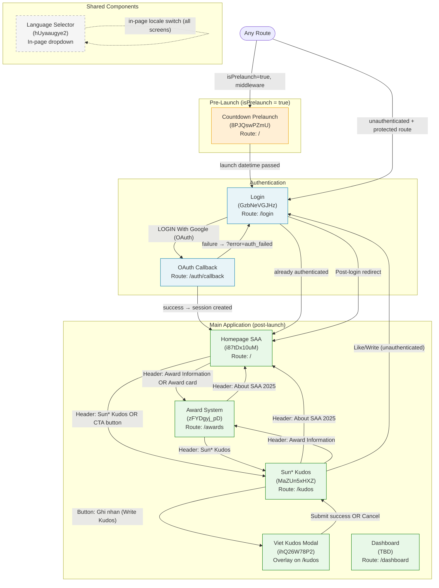

# Screen Flow Overview

## Project Info
- **Project Name**: SSA 2025
- **Figma File Key**: 9ypp4enmFmdK3YAFJLIu6C
- **MoMorph URL**: https://momorph.ai/files/9ypp4enmFmdK3YAFJLIu6C/screens/GzbNeVGJHz
- **Created**: 2026-04-22
- **Last Updated**: 2026-04-22

---

## Discovery Progress

| Metric | Count |
|--------|-------|
| Total Screens | 8 (from yêu cầu.csv) |
| Discovered | 7 unique frames |
| Remaining | Dashboard (TBD) |
| Completion | ~85% |

---

## Screens

| # | Screen Name | Frame ID | Route | Figma Link | Status | Spec File | Navigations To |
|---|-------------|----------|-------|------------|--------|-----------|----------------|
| 1 | Countdown Prelaunch | 8PJQswPZmU | `/` (pre-launch) | https://momorph.ai/files/9ypp4enmFmdK3YAFJLIu6C/screens/8PJQswPZmU | specs-ready | `.momorph/specs/8PJQswPZmU-countdown-prelaunch/spec.md` | — (holds until launch) |
| 2 | Login | GzbNeVGJHz | `/login` | https://momorph.ai/files/9ypp4enmFmdK3YAFJLIu6C/screens/GzbNeVGJHz | specs-ready | `.momorph/specs/GzbNeVGJHz-login/spec.md` | `/` (homepage, post-login) |
| 3 | Homepage SAA | i87tDx10uM | `/` (post-launch) | https://momorph.ai/files/9ypp4enmFmdK3YAFJLIu6C/screens/i87tDx10uM | specs-ready | `.momorph/specs/i87tDx10uM-homepage-saa/spec.md` | `/awards`, `/kudos` |
| 4 | Award System | zFYDgyj_pD | `/awards` | https://momorph.ai/files/9ypp4enmFmdK3YAFJLIu6C/screens/zFYDgyj_pD | specs-ready | `.momorph/specs/zFYDgyj_pD-he-thong-giai/spec.md` | `/`, `/kudos` |
| 5 | Sun* Kudos | MaZUn5xHXZ | `/kudos` | https://momorph.ai/files/9ypp4enmFmdK3YAFJLIu6C/screens/MaZUn5xHXZ | specs-ready | `.momorph/specs/MaZUn5xHXZ-sun-kudos/spec.md` | `/login` (unauth), Viet Kudos modal |
| 6 | Viet Kudos (modal) | ihQ26W78P2 | `/kudos` (modal overlay) | https://momorph.ai/files/9ypp4enmFmdK3YAFJLIu6C/screens/ihQ26W78P2 | specs-ready | `.momorph/specs/ihQ26W78P2-viet-kudos/spec.md` | `/kudos` (close modal) |
| 7 | Language Selector (component) | hUyaaugye2 | N/A (shared component) | https://momorph.ai/files/9ypp4enmFmdK3YAFJLIu6C/screens/hUyaaugye2 | specs-ready | `.momorph/specs/hUyaaugye2-da-ngon-ngu/spec.md` | No route change |
| 8 | Dashboard | TBD | `/dashboard` | TBD | not-started | TBD | TBD |

---

## Registered Routes

| Route | Screen | Auth Required | Notes |
|-------|--------|---------------|-------|
| `/` | Countdown Prelaunch OR Homepage SAA | No | Pre-launch: renders countdown; post-launch: renders homepage. Middleware checks `LAUNCH_DATETIME` env var. |
| `/login` | Login | No (redirect away if authenticated) | Middleware redirects to `/` if valid session exists |
| `/awards` | Award System | No (public) | Award info is public; no auth required to browse |
| `/kudos` | Sun* Kudos | No (browse public; auth required to like or write) | Interactive actions (like, write) require auth → redirect to `/login` |
| `/dashboard` | Dashboard | Yes | Middleware redirects to `/login` if no valid session |
| `/auth/callback` | OAuth callback handler | No | Next.js route handler `app/auth/callback/route.ts`; exchanges OAuth code for session; redirects to `/` on success or `/login?error=auth_failed` on failure |

> **Implementation note for `/` route**: The same Next.js page at `app/page.tsx` renders either `<CountdownPage />` or `<HomePage />` based on a server-side `isPrelaunch` check (compare `Date.now()` against `process.env.LAUNCH_DATETIME`). The middleware also enforces the global countdown gate — if `isPrelaunch=true`, ALL routes redirect to `/`.

---

## Navigation Graph

---

## Navigation Edges — All Screens

### Countdown Prelaunch (`/`)

| Direction | Target/Source | Trigger | Condition |
|-----------|--------------|---------|-----------|
| OUT | `/login` | Automatic (launch time passed or admin opens) | `isPrelaunch` flips to `false` |
| IN | Any route | Middleware redirect | `isPrelaunch = true` |

### Login (`/login`)

| Direction | Target/Source | Trigger | Condition |
|-----------|--------------|---------|-----------|
| OUT | `/auth/callback` → `/` | "LOGIN With Google" button | OAuth flow initiates |
| OUT | `/` | Already-authenticated check | Valid session exists on page load |
| IN | Countdown | Launch datetime passes | `isPrelaunch` flips |
| IN | Any protected route | Middleware | No valid session |
| IN | `/kudos` | Like/Write action (unauth) | Not logged in |

### Homepage SAA (`/`)

| Direction | Target/Source | Trigger | Condition |
|-----------|--------------|---------|-----------|
| OUT | `/awards` | Header "Award Information" nav OR Award section CTA | Click |
| OUT | `/kudos` | Header "Sun* Kudos" nav OR "Sun* Kudos" CTA button | Click |
| IN | `/auth/callback` | Post-OAuth redirect | Login success |
| IN | Any screen | Header logo click | N/A |

### Award System (`/awards`)

| Direction | Target/Source | Trigger | Condition |
|-----------|--------------|---------|-----------|
| OUT | `/` | Header "About SAA 2025" nav | Click |
| OUT | `/kudos` | Header "Sun* Kudos" nav OR Kudos promo CTA | Click |
| IN | `/` | Award card or CTA | Click |
| IN | `/kudos` | Header nav | Click |
| DEEP LINK | `/awards#top-talent` etc. | Left nav category click | URL hash updates |

### Sun* Kudos (`/kudos`)

| Direction | Target/Source | Trigger | Condition |
|-----------|--------------|---------|-----------|
| OUT | `/` | Header "About SAA 2025" nav | Click |
| OUT | `/awards` | Header "Award Information" nav | Click |
| OUT | `/login` | Like or Write action | User is unauthenticated |
| OUT | Viet Kudos modal | "Ghi nhan" button | User is authenticated |
| IN | `/` | CTA "Sun* Kudos" or nav | Click |
| IN | `/awards` | Nav | Click |
| IN | `/auth/callback` | Post-login redirect (if Kudos was the protected action) | Login success |

### Viet Kudos Modal (overlay on `/kudos`)

| Direction | Target/Source | Trigger | Condition |
|-----------|--------------|---------|-----------|
| OUT (close) | `/kudos` (modal closes) | Cancel button OR Escape | N/A |
| OUT (submit) | `/kudos` (modal closes + feed updates) | "Gui" button | Submit success |
| IN | `/kudos` | "Ghi nhan" button click | User is authenticated |

### Language Selector (shared component)

| Direction | Target | Trigger | Condition |
|-----------|--------|---------|-----------|
| — | No route change | Dropdown option click | Locale cookie updated |

---

## API Endpoints Summary

| Endpoint | Method | Auth | Screens Using | Purpose |
|----------|--------|------|---------------|---------|
| `supabase.auth.signInWithOAuth` | — | No | Login | Initiate Google OAuth |
| `supabase.auth.exchangeCodeForSession` | — | No | `/auth/callback` | Exchange code for session |
| `supabase.auth.getSession()` | — | Yes | All authenticated | Check session on page load |
| `GET /api/kudos` | GET | No (browse) | Sun* Kudos | Paginated kudos feed |
| `GET /api/kudos/highlights` | GET | No | Sun* Kudos | Top 5 most-liked |
| `GET /api/kudos/spotlight` | GET | No | Sun* Kudos | Spotlight boards |
| `GET /api/kudos/stats` | GET | No | Sun* Kudos | General statistics |
| `GET /api/kudos/top-sunners` | GET | No | Sun* Kudos | Top 10 recipients |
| `POST /api/kudos/:id/like` | POST | Yes | Sun* Kudos | Like a kudos |
| `DELETE /api/kudos/:id/like` | DELETE | Yes | Sun* Kudos | Unlike a kudos |
| `GET /api/admin/special-days` | GET | No (cached) | Sun* Kudos | Check special day status |
| `GET /api/awards` | GET | No | Awards, Homepage | Award category data |
| `GET /api/users/search` | GET | Yes | Viet Kudos | Search sunner by name |
| `GET /api/kudos/hashtags` | GET | Yes | Viet Kudos | Available hashtag list |
| `POST /api/kudos` | POST | Yes | Viet Kudos | Submit new kudos |
| `POST /api/upload` | POST | Yes | Viet Kudos | Upload image to Supabase Storage |

---

## Authentication Flow

- Authentication: Supabase Auth Google OAuth only
- Session: `HttpOnly`, `Secure`, `SameSite=Strict` cookie — `localStorage` is FORBIDDEN
- Middleware: Next.js middleware checks session on every request; pre-launch gate runs before auth check
- RLS: Enabled on all user-data tables (kudos, likes, users)

---

## Discovery Log

| Date | Action | Screens | Notes |
|------|--------|---------|-------|
| 2026-04-22 | Initial discovery | Login (GzbNeVGJHz) | MoMorph returned no registered frames; documented from Figma + constitution |
| 2026-04-22 | Expanded discovery | +6 screens from yêu cầu.csv | Frame IDs found via list_frames API; all specs created |

---

## Open Questions / Next Steps

- [ ] Confirm actual route for Homepage after login: `/` or `/home`? (Currently specced as `/` with conditional render)
- [ ] Confirm Dashboard frame ID and route from design team
- [ ] Confirm "About SAA 2025" CTA on homepage: in-page scroll to awards section, OR navigate to `/awards`?
- [ ] Confirm `/awards#category` hash behavior: does left nav click update URL hash?
- [ ] Confirm Sun* Kudos feed auto-refresh interval (or polling vs WebSocket)
- [ ] Run `momorph.screenflow` again once Dashboard frame is available
